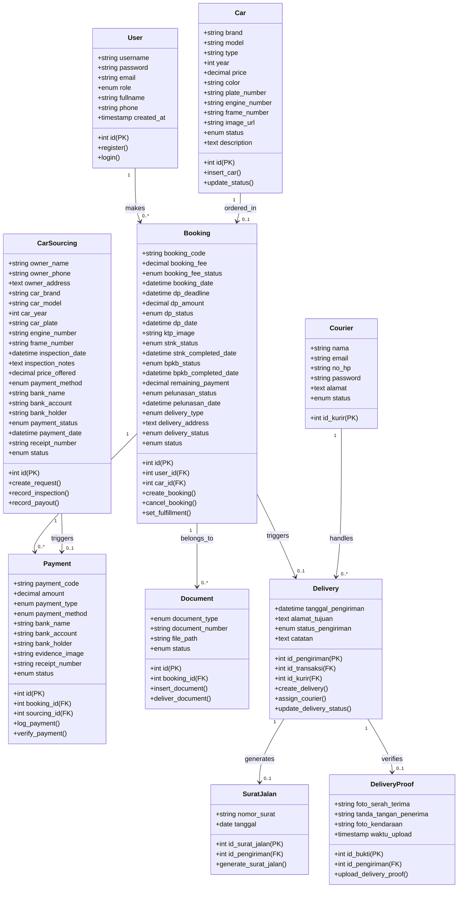
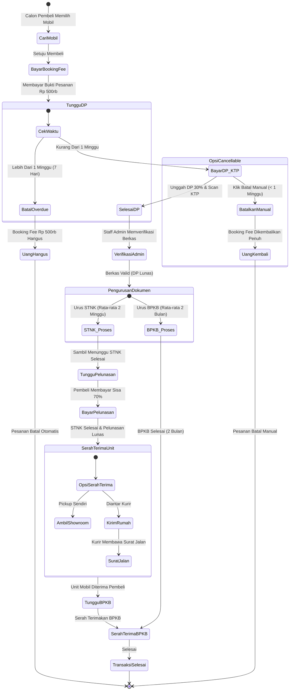
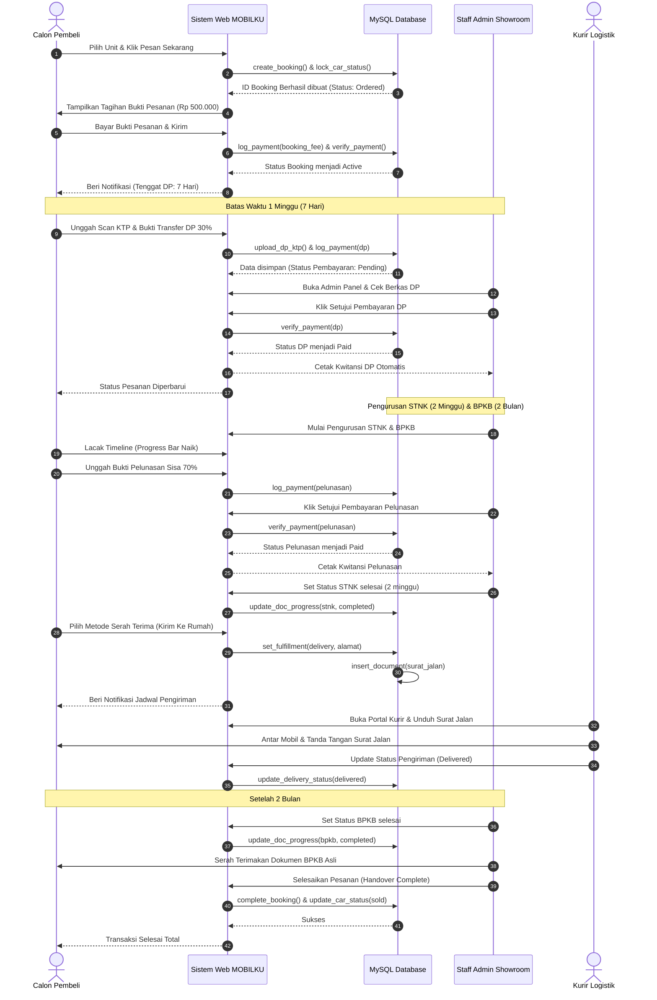

# Dokumentasi Diagram UML - MOBILKU
**Mata Kuliah: Analisis dan Perancangan Sistem Informasi (Semester 4)**

---

## 1. Panduan Integrasi Draw.io
Showroom Anda sudah memiliki beberapa file `.drawio` di folder [diagram-mobil](file:///c:/Users/ISAGI/OneDrive/Documents/SEMESTER%204/MOBILKU/diagram-mobil). Dokumen ini menyajikan model rancangan usulan terbaru dalam format **Mermaid UML Syntax** interaktif. Anda dapat langsung menyalin kode Mermaid di bawah ini ke editor online (seperti [mermaid.live](https://mermaid.live)) untuk mengekspor gambar vector (.png/.svg) untuk laporan kuliah Anda, atau memperbarui diagram Draw.io Anda berdasarkan struktur matang di bawah.

---

## 2. Use Case Diagram
Menggambarkan interaksi aktor (Calon Pembeli, Penjual Perorangan, Staff/Admin, Kurir) dengan fungsionalitas sistem **MOBILKU**.

```mermaid
usecaseDiagram
    actor Pembeli as "Calon Pembeli"
    actor Penjual as "Penjual Perorangan"
    actor Staff as "Staff / Admin Showroom"
    actor Kurir as "Kurir Logistik"

    %% Pembeli Use Cases
    Pembeli --> (Lihat Katalog & Filter Mobil)
    Pembeli --> (Checkout Booking Fee Rp 500rb)
    Pembeli --> (Unggah DP 30% & Scan KTP)
    Pembeli --> (Unggah Bukti Pelunasan 70%)
    Pembeli --> (Konfigurasi Serah Terima)
    Pembeli --> (Lacak Timeline Administrasi)

    %% Penjual Use Cases
    Penjual --> (Tawarkan Mobil / Sourcing Form)

    %% Staff / Admin Use Cases
    Staff --> (Verifikasi Pembayaran & Beri Kwitansi)
    Staff --> (Update Status STNK & BPKB)
    Staff --> (Input Hasil Inspeksi Sourcing)
    Staff --> (Proses Pembayaran Sourcing & Payout)
    Staff --> (Kelola Inventori Mobil)

    %% Kurir Use Cases
    Kurir --> (Lihat Jadwal & Dashboard Pengiriman)
    Kurir --> (Unduh/Cetak Surat Jalan)
    Kurir --> (Update Status Pengiriman)
    Kurir --> (Unggah Bukti Serah Terima & Foto)
    Kurir --> (Lihat Riwayat Pengiriman)
```

---

## 3. Class Diagram
Menggambarkan struktur kelas, relasi database (Active Record), dan kardinalitas antar entitas dalam sistem **MOBILKU**.



---

## 4. Activity Diagram (Alur Jual-Beli Mobil)
Menggambarkan alur aktivitas transaksi pembelian mobil bekas, mencakup tenggat waktu DP 1 minggu, pengurusan STNK & BPKB, serta serah terima unit.



---

## 5. Sequence Diagram (Booking & Timeline Checklist)
Menggambarkan interaksi antar objek sistem berdasarkan urutan waktu dari pemesanan hingga serah terima berkas BPKB.


